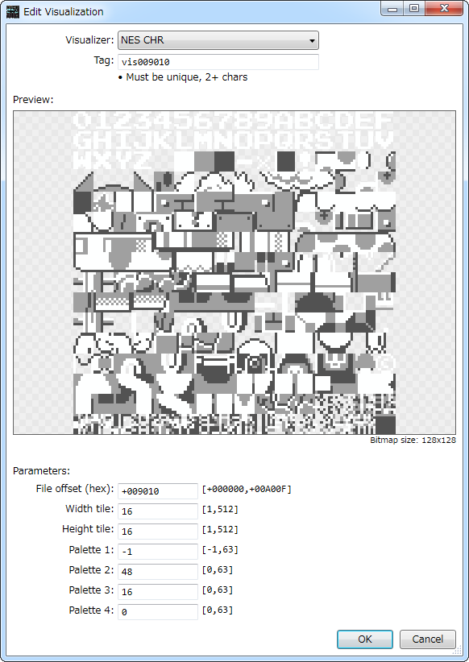
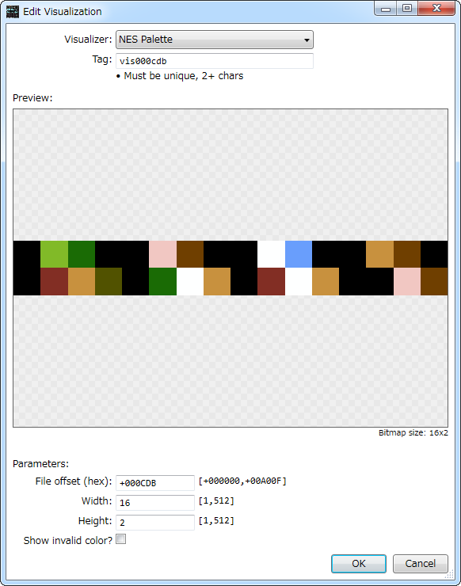
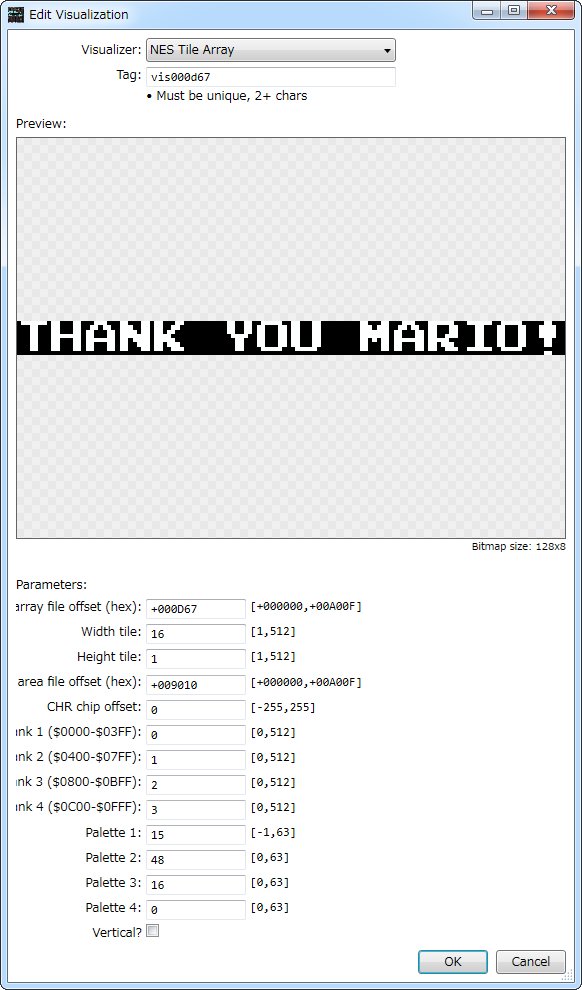
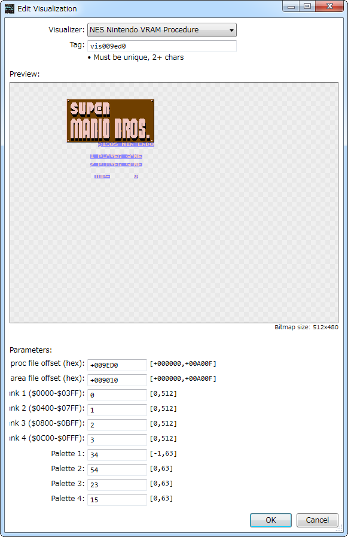

# [6502bench](https://github.com/fadden/6502bench) Scripts  

## [VisNesChr](Extension%20Scripts/Nintendo/VisNesChr.cs)  

  

## [VisNesPalette](Extension%20Scripts/Nintendo/VisNesPalette.cs)  

  

## [VisNesTileArray](Extension%20Scripts/Nintendo/VisNesTileArray.cs)  

  

## [VisNintendoVramProcTile](Extension%20Scripts/Nintendo/VisNintendoVramProcTile.cs)  

  

## Symbols  

### [NES-MMC3.sym65](Symbols/Nintendo/NES-MMC3.sym65)  

### SNES-SA-1.sym65  

Move to [official repositories](https://github.com/fadden/6502bench).  

## Utilities  

### [MesenDebugBuild](Utilities/MesenDebugBuild.bat)  

Generate .dbg file for source debug in [Mesen](https://github.com/SourMesen/Mesen).  
Please also prepare [cc65](https://cc65.github.io/).  

## License  

Apache 2.0.  
Please refer to each source code for license terms.  
